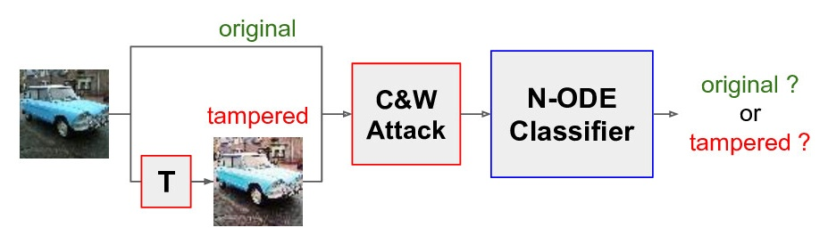

Adversarial Robustness of Neural ODE in Image Forensic
---



Code to reproduce results of the paper 'Tuning Neural ODE Networks to Increase
Adversarial Robustness in Image Forensics' by Roberto Caldelli, Fabio Carrara, and Fabrizio Falchi.

## Requirements

 * Python >= 3.7
 * `torch>=1.9.1`
 * `pytorch-lightning==1.5.6`
 * `foolbox==3.3.1`
 * torchdiffeq==0.2.2`

We provide a [`Dockerfile`](Dockerfile) to setup the environment we used during experiments.

## Reproduce

Download the data:

```bash
cd data/
./download_data.sh
cd ..
```

Use the [`reproduce.sh`](reproduce.sh) script to train the models and generate adversarial samples:

```bash
./reproduce.sh
```

WARNING: Adversarial generation can take days. Results will be store in the `runs/` folder.

Run the [`show.ipynb`](show.ipynb) notebook to generate plots and aggregated results of the paper.